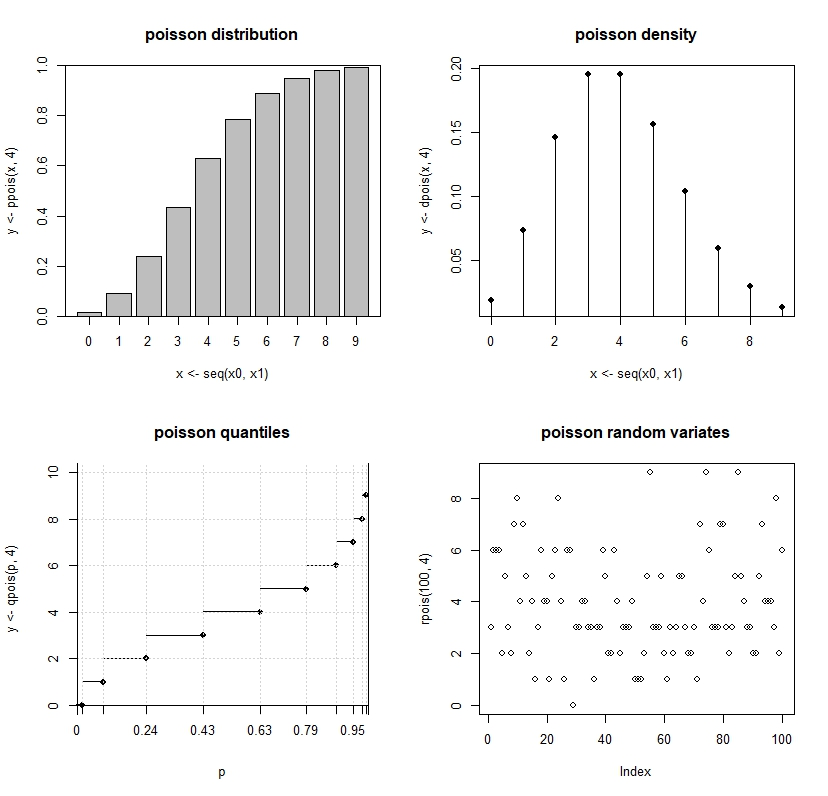
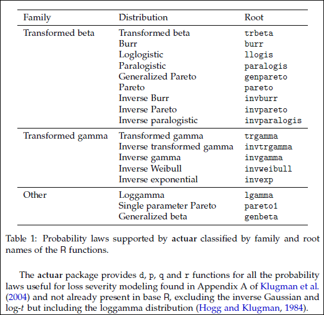

```{r setup, include=FALSE}
knitr::opts_chunk$set(echo = TRUE)
```

## Agenda

- theoretical
- empirical
- the actuar package

## Theoretical

- R has many theoretical distributions builtin

- Here are some *names*

    - pois, binomial

    - norm, lnorm, weibull, exp
    
- To use the distributions, preface the *name* with one of four letters

letter | purpose | example
------ | --------------------------- | -----------------------
p | probability distribution; F(x) or P(X<=x) | pnorm(x, mu=0, sd=1)
d | density; f(x) or P(X==x) | dpois(2, lambda=1)
q | quantile; value of x that gives the distribution p; inverse of **p** | qnorm(.5, 0, 1)
r | pseudorandom values | rexp(10, rate=1)

```{r}
# Generate 1000 random lognormal random variables with parameters mulog = 1, sdlog = .5
severity <- rlnorm(1000, 1, .5)
```

- When testing you will usually want to generate the same set of random values

    - Use the set.seed function
    
```{r}
# Generate 1000 random lognormal random variables with parameters mulog = 1, sdlog = .5
set.seed(12345)
severity <- rlnorm(1000, 1, .5)
```

- Call up R's help for lnorm, exp or pois

    - Hint: Use the full English name of the distribution, capitalized
    
- More help, other theoretical distributions

    - CRAN has a "view"on probability distributions where you can find more information
    
    - http://cran.r-project.org/web/views/Distributions.html

## Graphing theoretical distributions

- density (d) and distribution (p) functions

  - Choose the quantile function to get a suitable range of x-axis values
  
      - Use the 'seq' function to generate the probabilities for the quantiles
      
```{r}
prob <- seq(.005, .995, by = .005)
x <- qnorm(prob, 0, 1)
y <- dnorm(x, 0, 1)
plot(x, y)
```

## Plot the four standard normal functions on one page

```{r pressure}
# 4 graphs on a page, row-wise
op <- par(mfrow=c(2,2)) 
plot(x <- qnorm(prob <- seq(.005, .995, by = .005)), dnorm(x))
plot(x, y = pnorm(x))
plot(prob, qnorm(prob))
plot(rnorm(100), main = "white noise")
par(op) # reset to 1 graph per page
```

## Discrete Distribution Plots

- Poisson example



## Empirical distribution functions

- For working with empirical data distributions,
there is not the same *prefix-name* construct

- R has functions to operate on your data
    
purpose | function          | comments
---------------------- | ----------------------- | -------------------------
density | density; hist | density for continuous r.v.'s; hist for discrete or grouped r.v.'s
distribution | ecdf | Empirical cumulative distribution function; creates a function that can be evaluated at different values of x
quantile | quantile | Given a vector of data x, quantile returns the x value at your requested probability(ies)
pseudorandom values | sample | Given a vector of data x, sample returns **n** random values from x, with or without replacement

## Example: simulate and plot gamma-distributed claims

```{r}
# Simulate 25 gamma-distributed claims
# FYI for Gamma: E(X) = shape * scale, 
#    Var(X) = shape * scale^2, 
set.seed(12345)
clm <- rgamma(25, shape = 2, scale = 5000)
summary(clm)
op <- par(mfrow = c(3, 2)) #3 rows, 2 columns
plot(clm)
plot(ecdf(clm))
plot(density(clm))
hist(clm)
hist(clm, breaks = seq(range(clm)[1], range(clm)[2], length = 11))
par(op)
```

- Extra credit: why do none of these plot calls have x and y arguments as opposed to their
theoretical counterparts?

## Exercise

Generate the four graphs -- distribution, density, quantile, and random variates -- for a lognormal random variable with mean = 1000 and sd = 200

## An Example

- Assume the average number of claims in an accident year is 100 and 
follows a Poisson distribution

- Assume the severity is lognormally distributed with meanlog = 6.5 and sdlog = .8

- Simulate 10000 trials of total loss in an accident year.

    - using a loop
    
    - using an 'apply' function

```{r}
N <- 10000 # number of trials
# Loop
TotalLossLoop <- numeric(N)
for (i in 1:N) {
  numclaims <- rpois(1, 100)
  claims <- rlnorm(numclaims, 6.5, .8)
  TotalLossLoop[i] <- sum(claims)
}
print(mean(TotalLossLoop))
# apply function
numclaims <- rpois(N, 100)
TotalLossApply <- sapply(numclaims, function(n) sum(rlnorm(n, 6.5, .8)))
print(mean(TotalLossApply))
```

## actuar package

Written by Vincent Goulet for his students, and others

Contains additional distributions



## New Prefixes in actuar

- **m**   moment functions

- **lev** limited expected value functions

- Examples

```{r}
library(actuar)
lnormParms <- function(mean, std){
  stopifnot(length(mean) == length(std))
  if (any(mean < 0) | any(std < 0)) stop("Negative mean or std")
  sigma2 <- log(1 + (std / mean)^2)
  mu     <- log(mean) - .5 * sigma2
  cbind(mulog = mu, sdlog = sqrt(sigma2))[,]
  }
print(lnormParms(mean=1000, std=1000))
mlnorm(order = 1, meanlog = 6.5611817, sdlog = 0.8325546) # theoretical E(X)
levlnorm(1000, meanlog = 6.5611817, sdlog = 0.8325546, order = 1)
```

## actuar word problem

Assume you fit a lognormal to your data and got the parameters
meanlog = 7.9, sdlog = 1.5.
Using actuar, what was the mean of your data (or close to it))?

```{r}
mlnorm(1, meanlog = 7.9, sdlog = 1.5)
```

Calculate an increased limits factor from $25,000 to $100,000.

```{r}
levlnorm(100000, meanlog = 7.9, sdlog = 1.5) / levlnorm(25000, meanlog = 7.9, sdlog = 1.5)
```
