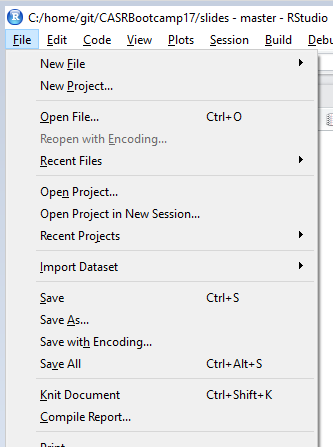
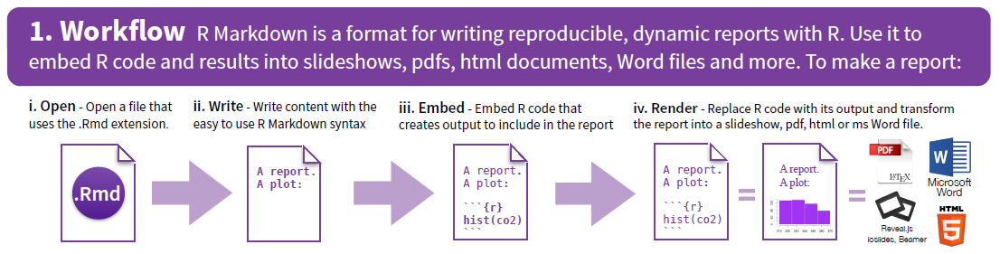
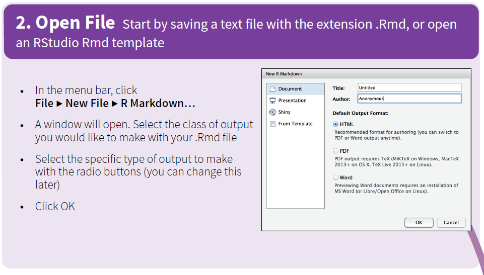
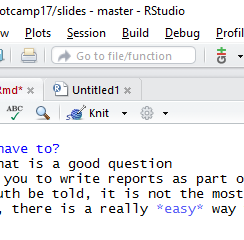
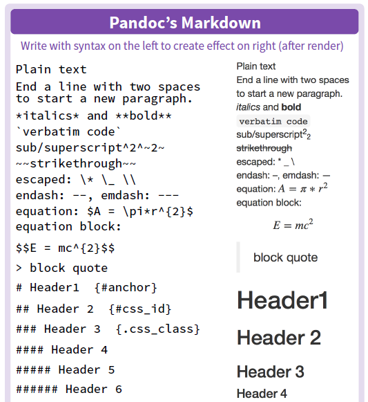
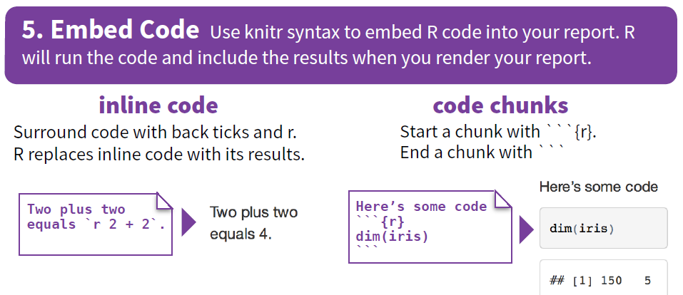
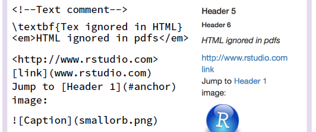
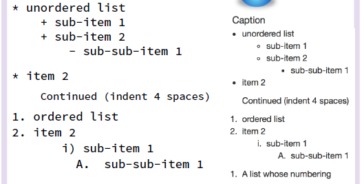
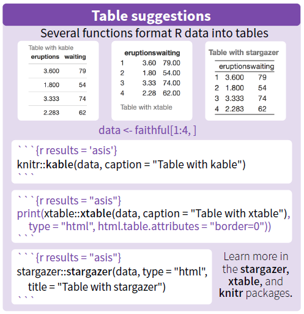
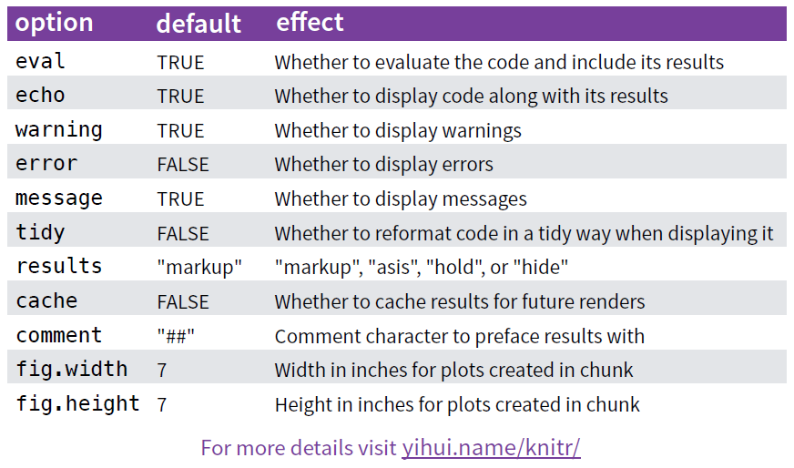

## Do we have to?
* Hmmm, that is a good question
* We want you to write reports as part of your capstone
* But, truth be told, it is not the most important part
* Besides, there is a really *easy* way for you to do it...

## An Easy Way, Tell Me More

## Using Compile Report
* Keep your code clean and organized
* Write good comments, like you would in a report
* Use this comment character #'
* Cool things will happen
* And, this is just the beginning

## Another Way Using Rmd Files
Create a new file

## Create a New File

## Render!

## What we can do...

## Embed Code

## Images and Links

## Lists

## Tables

## Chunk Options
This is more advanced stuff, but here it is

## Where to get more help
* Use the cheatsheet
* [http://rmarkdown.rstudio.com/](http://rmarkdown.rstudio.com/)

